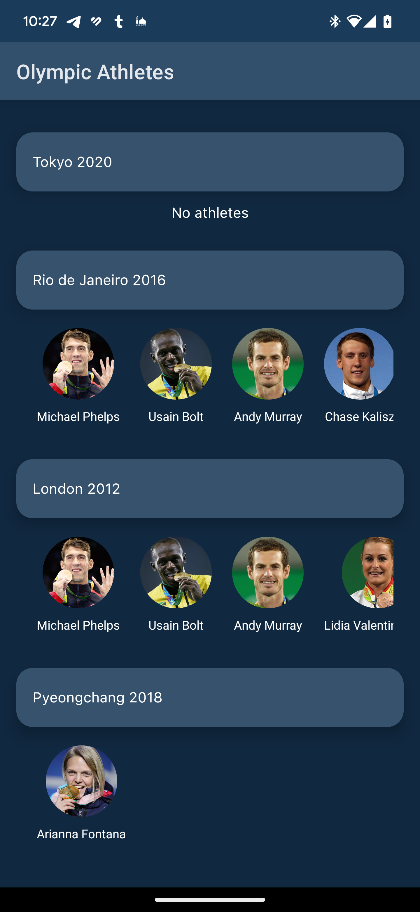
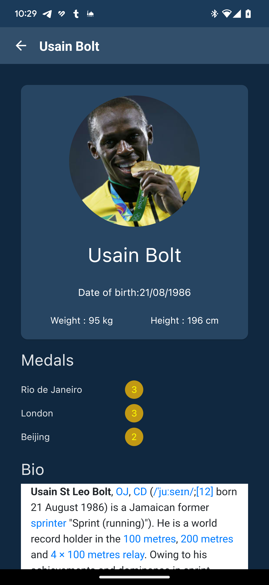

# OBS Android App 

## Screenshots

  
## Setup

To run the app, please follow these steps:

1. Clone the Git URL in Android Studio.
2. Wait for Gradle to finish building the project.
3. Select the device you want to run the app on.
4. Click on the run button.

## Project Description

This app is built using MVI (Model-View-Intent) Clean Architecture, which provides a modular and scalable approach to building Android apps. The app also uses Jetpack Compose for UI development, Retrofit for remote API communication, Room Database for local database storage, and Dagger Hilt for dependency injection.

### MVI Clean Architecture

The MVI Clean Architecture pattern separates the app into different layers, with each layer having a specific responsibility. The layers are:

1. Domain layer: This layer contains the business logic of the app.
2. Data layer: This layer is responsible for retrieving and storing data, both locally and remotely.
3. Presentation layer: This layer is responsible for displaying the data to the user.

This architecture allows for better separation of concerns and easier testing.

### Jetpack Compose

Jetpack Compose is a modern UI toolkit for building Android apps using a declarative programming model. It simplifies the process of creating complex UIs and provides a more efficient way of building UIs compared to the traditional XML layout approach.

### Retrofit

Retrofit is a type-safe HTTP client for Android and Java. It makes it easy to consume RESTful web services by translating the API into Java interfaces. It also provides features like automatic JSON parsing and error handling.

### Room Database

Room Database is a persistence library that provides an abstraction layer over SQLite. It simplifies the process of working with SQLite databases and provides compile-time verification of SQL queries.

### Dagger Hilt

Dagger Hilt is a dependency injection library for Android apps built on top of Dagger 2. It provides a simple way to handle dependencies and makes it easy to manage the object graph of the app.
